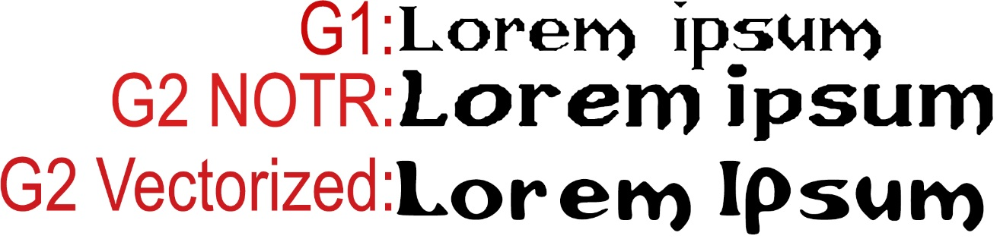

# Introduction

This project contains converted original bitmap font from `Gothic 2` game (without Night of The Raven Add-On) into vectorized format.

Since i'm not a proffesional graphics designer, the vectorized font might not have proper proportions, letter sizes/spacings might be slightly off, etc.  
If you want to improve the font, just open up the [pull request](https://github.com/Patrix9999/Gothic-2-Font/pulls).

# Motivation

You might be thinking, *hey, .ttf fonts are already available on [World of Gothic](https://www.worldofgothic.de/dl/download_folder8.htm) website [here](https://www.worldofgothic.de/dl/download_137.htm) and [here](https://www.worldofgothic.de/dl/download_138.htm)*, well.. they are, but they look really ugly.  
To be honest, they look like someone would taken a bite out of them, whereas vectorized font looks smooth and nice, you can see the difference yourself below.

# Comparison

## How to use

1. [Download](https://github.com/Patrix9999/Gothic-2-Font/releases) a release.
2. Install a .ttf font
3. Enjoy!

# File description

- [g2-font.svg](g2-font.svg)  
	This file contains vectorized letters and was generated and scaled in [InkSpace](https://inkscape.org/)
- [GothicII.sfd](GothicII.ttf.sfd)  
	This file is a [Font Forge](https://fontforge.org/en-US/) project that contains each defined letter for .ttf font.

# Contribute

The official repository of this project is available at: https://github.com/Patrix9999/Gothic-2-Font.

# How to convert bitmap font to vectorized one

1. First of, you need to extract the font that you want to convert from the game (image).
2. After getting your .tga texture with a font, you need to remove all of the background and red lines separating each symbol
3. Now, you should only have the letters on transparent background, in order to convert them to vectorized format you'll be needing these programs:
	- [InkSpace](https://inkscape.org/) which is a program for editing vectorized images, or converting rasterized images to vectorized ones
	- [Font Forge](https://fontforge.org/en-US/) for creating an actual font and filling each letter with vectorized letter
4. Here's a [tutorial](https://www.youtube.com/watch?v=1PX3KrwgLNc) explaining how to convert your pixel image to vector graphic.  
	Keep in mind that the auto conversion tool might do some erros, so be sure, to play around with the settings to achive the best results + be aware that some of the problems must be fixed by you later manually unfortunately.
5. After converting your image, you need to split each letter into separate vector path, to do that:
	- Select the whole vector image
	- Click option: Path->Break Apart
6. After splitting each path into separate parts, you need to combine letter paths into one for each character, to do that:
	- Select paths that you want to combine using selection tool
	- Press `CTRL+K`
	- Optionally, it would be good idea to rename the combined path to letter character, so that it's easier to navigate
7. Congratulations, now, the only thing left to do is to define a .ttf font, here's a good [tutorial](https://www.youtube.com/watch?v=kfEEBEGJ5kk) that explains how to do that.